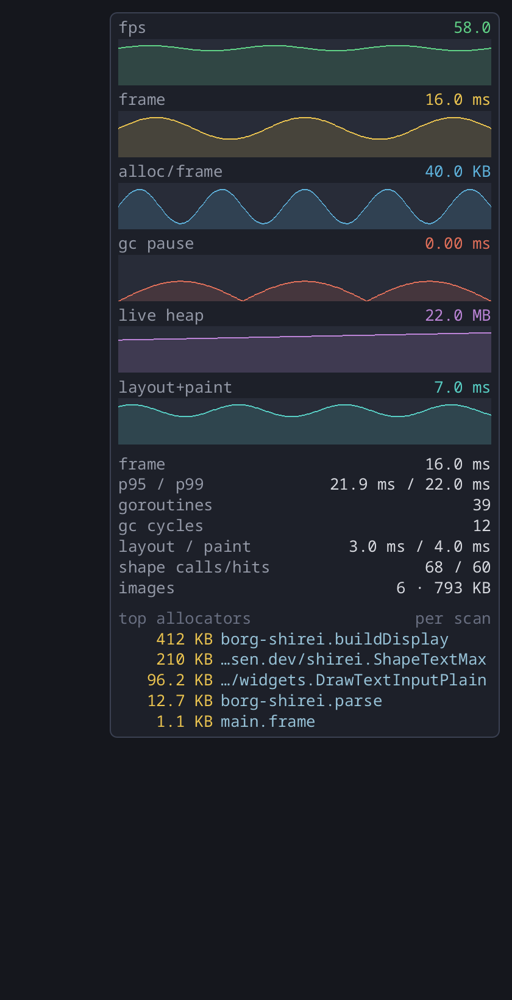
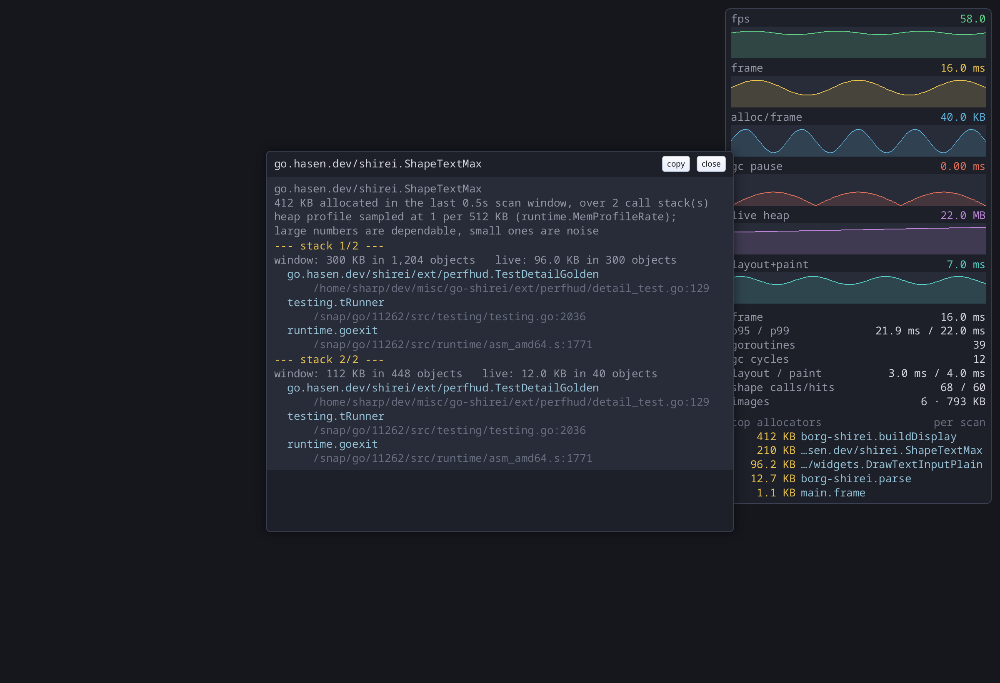

# perfhud

A performance overlay and hitch recorder for a Shirei app.



Rolling charts of frame rate, frame time, allocation per frame, GC pause,
live heap and layout+paint. Under them, the scalar counters and the current
top allocation sites. Behind all of it, a detector that writes a full record
of any frame that runs far slower than the app's own baseline.

## Try it

```
go run ./demos/perfhud
```

Buttons that move each chart on purpose: allocate per frame, lay out
thousands of labels, defeat the shape cache, park goroutines, stall one frame
to trigger a hitch record. The demo also registers a probe, a chart, a stat
row and a table of its own, so it doubles as the worked example for the
section below.

## Use it

```go
import "go.hasen.dev/shirei/ext/perfhud"

func frame() {
	// ...build the UI...
	perfhud.Draw()   // last statement, so the panel floats over everything
}
```

That is the whole integration. `Draw` samples on every call and paints only
while `perfhud.Visible` is set, so the hitch recorder keeps working with the
charts hidden. Bind `perfhud.Toggle` to a key, or launch with `SHIREI_HUD=1`
to start with the panel up.

## Record hitches

Off by default, because it writes files:

```go
perfhud.Config.HitchLog = "myapp-hitches.log"
perfhud.Config.Context = func() string { return currentViewName() }
```

A frame slower than `max(33ms, 2.5 × the rolling median)` appends a record:
the phase breakdown, the memory counters, the recent frame times, the top
allocators, the name of the view, and every goroutine's stack. Beside it goes
an execution trace of the preceding few seconds, from a
`runtime/trace.FlightRecorder`, ready for `go tool trace`.

The threshold is relative on purpose. An app that runs at 8ms and an app that
runs at 30ms both get told about their own outliers, and neither is told
about the other's baseline.

Records are rate-limited to one per two seconds, traces to one per ten, and
old traces are pruned to `Config.KeepTraces`.

## Click a row

Rows in the top-allocator table are clickable. A click opens the full call
stack behind that site: every stack folded into the row, innermost frame
first, with function, file and line; the bytes and objects allocated in the
scan window; and how much of it is still live. **copy** puts the whole report
on the clipboard, ready to paste into a bug report.



Shirei runs one window per process, so a library cannot open a second OS
window — the view is a panel inside the app's own window. An app that *can*
open a real one (by spawning itself with a flag, the way borg does its card
window) takes over with a hook:

```go
perfhud.Config.OpenDetail = func(title, text string) bool {
	spawnStackWindow(title, text)
	return true // handled; do not open the built-in panel
}
```

Any table can do this, not just the allocator one: set `Detail` on it.

```go
perfhud.AddTable(perfhud.Table{
	Title: "slowest views", Header: "ms", Limit: 5,
	Rows:   func() []perfhud.TableRow { ... },
	Detail: func(row int) string { return fullReportFor(row) },
})
```

## Add your own

The panel is three lists, and each is an extension point.

**A key/value row.** The cheapest one:

```go
perfhud.AddStats(func() []perfhud.Stat {
	return []perfhud.Stat{
		{Key: "rows", Value: perfhud.FormatCount(float64(len(lines)))},
		{Key: "doc", Value: perfhud.FormatBytes(float64(len(source)))},
	}
})
```

**A chart.** A chart plots history, and only probes are kept in the history,
so register the number first and read it back with `ProbeValue`:

```go
q := perfhud.AddProbe("queue", func() float64 { return float64(len(queue)) })
perfhud.AddChart(perfhud.Chart{
	Title:  "queue depth",
	Value:  perfhud.ProbeValue(q),
	Format: perfhud.FormatCount,
	Floor:  10,   // the y axis never scales below this
})
```

Leave `Color` unset and the chart takes the next color from the theme.

**A table** — the top-allocator shape, for any other "what is costing me"
list:

```go
perfhud.AddTable(perfhud.Table{
	Title: "slowest views", Header: "ms", Limit: 5,
	Rows: func() []perfhud.TableRow {
		out := make([]perfhud.TableRow, 0, len(timings))
		for _, v := range timings {
			out = append(out, perfhud.TableRow{
				Value: perfhud.FormatMs(v.ms), Name: v.name,
			})
		}
		return out
	},
})
```

`Limit` reserves that many lines whether or not the list fills them, so a
list that shrinks for a frame cannot resize the panel.

All three are plain slices — `Config.Charts`, `Config.Stats`, `Config.Tables`
— so an app can also reorder them or drop the built-ins entirely.
`DefaultCharts`, `BuiltinStats` and `AllocatorTable` return the defaults if
you want some of them back.

## Formatting

The numbers span a 0.02ms GC pause to a two-gigabyte heap and get read at a
glance while something is going wrong, so every value carries its unit and
steps up rather than growing digits: `2.0 MB`, not `2036 KB`; `12,480`, not
`12480`. The formatters are exported — `FormatNumber`, `FormatCount`,
`FormatMs`, `FormatBytes`, `FormatKB`, `FormatMB` — and a chart or a row can
use any of them, or its own.

## Configuration

Everything else lives on `perfhud.Config` — corner, width, chart height, font
size, history window, colors, how often the allocation profile is re-scanned.
The default theme is dark; Shirei has no theme object, so an app on a light
background sets `Config.Theme` itself.

`Config.KeepAwake` (on by default) asks for a frame every frame while the
panel is visible, so the charts scroll in an app that otherwise renders on
demand. That does mean the overlay pulls an idle app up to full frame rate
while it is open.

## Notes

The charts are rasterized into small RGBA images and blitted, because Shirei
draws boxes, text and images but has no polyline primitive, and a sparkline
built from one container per column would cost more than the thing it
measures. Pixels are registered at device resolution so the renderer blits
them 1:1.

The overlay allocates a little every frame (the formatted labels), so it
appears in its own allocation chart. That is honest, not a bug: read the
chart as a ceiling on what the app costs, not a floor.

The top-allocator numbers come from `runtime.MemProfile`, which samples at
`runtime.MemProfileRate`. Big allocators are dependable; small ones are
noise. The default rate (512 KB) is too coarse to see per-frame allocation in
a render loop — set `runtime.MemProfileRate = 16 * 1024` early in `main` if
the table looks empty. A scan window that catches no sampled allocation keeps
the previous list rather than blanking the table, because quiet windows are
normal and the flicker was worse than slightly stale numbers.

A row is named after the topmost frame outside the runtime and the
general-purpose standard library (`internalPrefixes` in `perfcore`). Without
that skip list every RGBA in the process collapses into one row called
`image.NewRGBA`, which tells you nothing — the name has to be the code that
asked for the memory, not the helper that handed it over.

`layout` can read higher than `frame` in a hitch record. Shirei's backend
settles a frame by running the build more than once, and `Host.LayoutTime`
reports the whole settle while each `Draw` sees only its own pass. Read a
large `layout` as "this frame needed several passes", which is itself the
finding.

The browser build skips the on-disk parts. The overlay and the detector still
run; only the log and the trace are missing.

## Porting it elsewhere

Inside the Shirei module it is one import. Outside it, copy this directory
and fix the module prefix. It depends on nothing but Shirei core and the
standard library.
